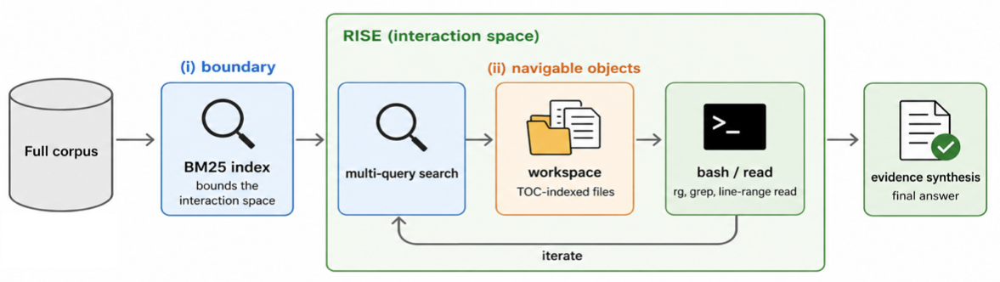

# RISE: Retrieving Interaction SpacE for Agentic Search
<a href="https://arxiv.org/abs/2606.06880"></a>

RISE treats retrieval as the constructor of a bounded **interaction space**: a
per-query workspace of files the agent explores with shell tools, rather than a
ranked list of snippets fed into the context window. It has two layers:

- **RISE-BM25** — the boundary: a multi-query BM25 search hardlinks the union
  of its top-*K* results into a per-query working directory; the agent then uses
  `bash` (`rg`, `grep`, …) and line-range `read` only inside it.
- **RISE** — RISE-BM25 plus *navigable objects*: each corpus document is
  processed offline into a line-numbered table of contents (TOC) so shell tools
  jump to sub-document spans without full reads.

We compare against two baselines: the BrowseComp-Plus **retrieval-agent**
(BM25, top-5 snippets + `get_document`) and **DCI** (pure-shell agent over the
raw corpus filesystem, no retriever).


## Layout

```
src/rise/            the package (agent loop, tools, retrieval, baselines, judging)
scripts/
  run_rise.py            RISE / RISE-BM25 runner
  run_retrieval_agent.py BCP retrieval-agent baseline
  run_dci.py             DCI pure-shell baseline
  judge.py               LLM-as-judge (BCP+ Appendix F prompt)
  build_bm25_index.py    build the BM25 index over the corpus
  build_filename_docid_map.py   map BM25 docids <-> corpus file paths
  summarize_runs.py      aggregate per-query results into a table
  structured/            offline TOC generation (RISE's consequence ii)
data/
  queries_100.jsonl      the exact 100-query evaluation set used in the paper
```

## Install

```bash
pip install -e .          # or: uv pip install -e .
cp .env.example .env      # then fill in API keys
```

## Data

The corpus and indexes are large derived artifacts, so they are not in this
repo. Reproduction needs four things; the first is included, the rest are
built/downloaded once.

1. **Query set — included.** `data/queries_100.jsonl`, one JSON object per line:
   `query_id`, `query` (the obfuscated question text), `answer` (gold answer
   string), `gold_doc_ids`. This is the *exact* 100-query sample used for every
   table in the paper — use it directly so your query set matches ours.

2. **BrowseComp-Plus corpus (100k docs).** Download the official
   BrowseComp-Plus corpus from HuggingFace
   (`Tevatron/browsecomp-plus-corpus`; `docid`/`text`/`url` schema, same `docid`
   scheme our `gold_doc_ids` index into) and export the documents to a flat file
   tree `corpus/bcp_plus/<domain>/<title>.txt`, plus the merged corpus parquet at
   `corpus/browsecomp_plus.parquet`. (The 1M setting adds 900k FineWeb-Edu
   distractors; see the paper §3 — same procedure, larger corpus.)

3. **BM25 index + docid↔path map.** Build the index once from the corpus:
   ```bash
   python scripts/build_bm25_index.py \
       --corpus corpus/browsecomp_plus.parquet --out runs/bm25_full
   ```
   bm25s defaults are used ($k_1{=}1.5, b{=}0.75$). The agents address documents
   by file path but `gold_doc_ids` / BM25 results are docids, so you also need a
   `runs/corpus_filename_docid_map.json` mapping the two. This map is emitted by
   the official BrowseComp-Plus corpus-export step (the same one that writes the
   flat file tree); see `scripts/build_filename_docid_map.py` for the expected
   format. We do not vendor the upstream exporter.

4. **Structured corpus (for RISE, consequence ii).** Either:
   - **download** our prebuilt TOC-augmented corpus parquet from
     `https://huggingface.co/datasets/Tevatron/browsecomp-plus-md-toc-gpt5.4-nano`
     (same `docid`/`text`/`url` schema as the original corpus, but each `text`
     carries an inserted line-numbered TOC + `##` section headings) and export it
     to a flat file tree `corpus/bcp_plus_structured/<domain>/<title>.txt`,
     exactly as in step 2; or
   - **rebuild** it with `scripts/structured/` (a one-time `gpt-5.4-nano` batch
     pass that proposes section anchors, then a deterministic step that inserts
     a line-numbered TOC; see that folder's scripts). Cost ≈ \$0.0014/doc.

## Reproducing the paper

All runs are over `data/queries_100.jsonl`; the judge is `gpt-5.1` with the
BrowseComp-Plus Appendix F prompt. After each run, judge it and summarize:

```bash
python scripts/judge.py --run-dir runs/<RUN_DIR> --mode online --judge-model gpt-5.1
python scripts/summarize_runs.py runs/<RUN_DIR>
```

> **Note:** `gpt-5.4-nano` runs must be launched with `REASONING_EFFORT=high`
> (the default is `medium`); the other models use `medium`. All runs use
> `--concurrency 4` in the paper.

### Table 1 (100k headline) — three agent models × four architectures

Per model `M` ∈ {`mimo-v2.5-pro`, `gpt-5.4-mini`, `gpt-5.4-nano`} (and the
`gpt-5.4` upper-bound probe):

```bash
# RISE (full method: bounded workspace + TOC documents)
python scripts/run_rise.py --model M --bm25-k 1000 --max-turns 100 \
    --concurrency 4 --structured-docs \
    --bc-plus-docs corpus/bcp_plus_structured \
    --out-root runs/rise_M_100k

# RISE-BM25 (boundary only, plain documents)
python scripts/run_rise.py --model M --bm25-k 1000 --max-turns 100 \
    --concurrency 4 --out-root runs/rise_bm25_M_100k

# retrieval-agent baseline (BM25 top-5 snippets + get_document)
python scripts/run_retrieval_agent.py --agent-model M \
    --per-search-k 5 --snippet-tokens 512 --max-iterations 100 \
    --concurrency 4 --out runs/retr_M_100k

# DCI baseline (pure shell over the full corpus, 300-call budget)
python scripts/run_dci.py --model M --max-model-calls 300 \
    --concurrency 4 --out-root runs/dci_M_100k
```

(`gpt-5.4-nano`: prepend `REASONING_EFFORT=high`. The `gpt-5.4` row in Table 1
is `run_rise.py --model gpt-5.4 --structured-docs`, a state-of-the-art
upper-bound probe.)

### Table 2 (100k → 1M scaling)

Same `run_rise.py` / `run_retrieval_agent.py` commands, but point at the 1M
corpus/index (`--index-dir runs/bm25_full_1m`, `--bc-plus-docs corpus/bcp_plus_1m`,
`--filename-map runs/corpus_filename_docid_map_1m.json`). At 1M we run RISE-BM25
(the structured corpus is not extended to the FineWeb distractors) and DCI only
on `gpt-5.4-nano`.

### Table 3 (BM25 top-*K* ablation)

`run_rise.py` (plain / RISE-BM25) with `--bm25-k` ∈ {100, 1000, 10000}.

## Notes

- Model routing is by name prefix in `src/rise/decompose.py`: `gpt-*` → OpenAI,
  `mimo-*` → Xiaomi, `deepseek-*` → DeepSeek (all OpenAI-compatible).
- `summarize_runs.py` recomputes every per-cell number from the per-query JSON,
  so reported accuracy / cost / tool-call means are reproducible from the raw
  run directory.
- The judge and the structured-corpus generator are LLMs; absolute numbers may
  drift slightly with provider-side model updates. Tool-call counts and the
  qualitative orderings (RISE ≈ DCI accuracy at ~¼ the cost; DCI's wall-clock
  collapse at 1M) are stable.
- We notice that `gpt-5.4-nano`, the weakest agent model, has noticeably higher
  run-to-run variance than the stronger tiers.

## Citation

```bibtex
@article{rise2026,
  title  = {Towards Retrieving Interaction Spaces for Agentic Search},
  author = {Zhuang, Shengyao and Ni, Yuansheng and Fun, Hengxin and Lin, Jimmy and Ma, Xueguang},
  year   = {2026},
  journal= {arXiv preprint arXiv:2606.06880}
}
```
